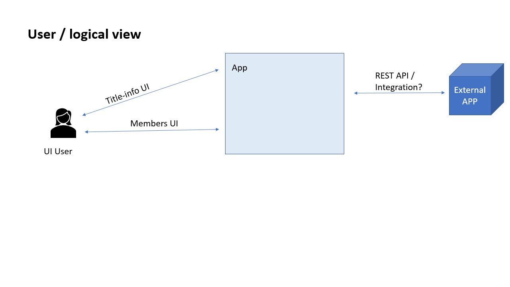
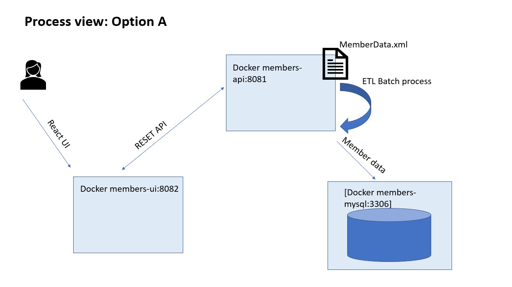

# Gabriel Enriquez - Programming Excercise API

Given the excercise at hand, I came up with 2 designs/implementation that I would like to discuss.

"Images speak a thousdand words", so... 
First things first, the "requierements". Overall, this needed to be a "simple API" for the given xml resource. This could be as simple as:

### Option A - Microservices

**Pros:**
- Each container/component could be managed (deployment, maintained, etc) separately. For instance, batch process could come out to its own process and probably verically scale more that given machine. More about the current batch/ETL process ahead. 
- Separate teams could focus on different components, even using different tech stack.
- Several -ilities (salability, high-availability, etc) can be handled with an orechestration service (e.g., k8n).

**Cons:**
- Mostly, with this added distributed flexibility, we are adding complexity for maintaining,distributing, development, deployment, etc.

For this main reason, and because it simply fits the "current requirements", I opted for Option B, see below.

### Option B - Monolith