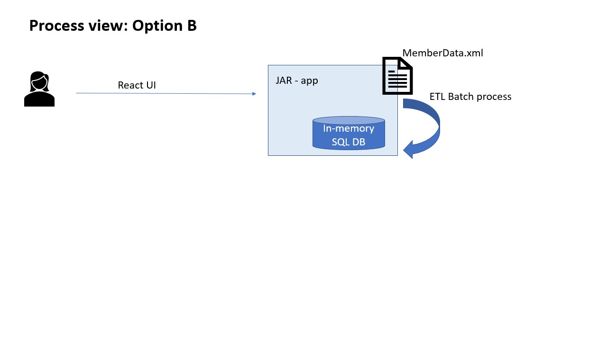

# Gabriel Enriquez - Programming Excercise API

Given the excercise at hand, I came up with 2 designs/implementation that I would like to discuss.

"Images speak a thousdand words", so... 
First things first, the "requierements". Overall, this needed to be a "simple API" for the given xml resource. This could be as simple as:


### Option A - Microservices


**Pros:**
- Each container/component could be managed (deployment, maintained, etc) separately. For instance, batch process could come out to its own process and probably verically scale more that given machine. More about the current batch/ETL process ahead. 
- Separate teams could focus on different components, even using different tech stack.
- Several -ilities (salability, high-availability, etc) can be handled with an orechestration service (e.g., k8n).

**Cons:**
- Mostly, with this added distributed flexibility, we are adding complexity for maintaining,distributing, development, deployment, etc.

For this main reason, and because it simply fits the "current requirements", I opted for Option B, see below.

##### Option A INSTALLATION

https://github.com/gabs79/member-api
**Note**, this steps are mostly for demostration purposes about this working part, but these steps should have been simplified further with a docker-compose-like option. But needed more time and effort. Overall, part of the added complexity on these microservices for only this excercise. 
1. Using docker, run an instance of MySQL

```
docker run --name members-mysql -e MYSQL_ROOT_PASSWORD=password -e MYSQL_DATABASE=members-db -e MYSQL_USER=sa -e MYSQL_PASSWORD=password -d mysql:5.6
```

2. Build 'members-api' Spring Boot applications with Maven. From it's root folder, use command ( (./mvnw for Linux)):

```
mvnw.cmd install
```

2.1 Build docker image for 'members-api'.

```
docker build -t members-api .
```

2.2 Run docker 'members-api'.

```
docker run -d -p 8081:8081 --name members-api --link members-mysql:mysql members-api
```

3. Repeat similar (Step 2 - 2.x) steps for 'member-ui'. Run command will look like.

```
docker run -d -p 8082:8082 --name members-ui --link members-api:members-api members-ui
```


### Option B - Monolith


Pros and Cons, pretty much opposite to Option-A.
- **Single point of failure**? No problem, spawn separate replica(s), especially if this is mostly read-only data (see assumptions below). The obvious trade-off will be between horizontal-scalability (distributed) vs consistency. But these trade-offs and/or decisions will have to be made based on actual business needs.

##### Option B INSTALLATION

- Execute jar x by double clicking (self contained and will spawn a Java process). Or if java is installed and want to see console, enter on command line "java -jar x". Executable jar located in https://github.com/gabs79/member-m/blob/master/springboot-member-api.jar.

- OR, to build jar on your cloned env then,
```
mvnw.cmd install
```

****Applications details:****
- The Option A, should display on root index the UI with title-info data on home page. This was a "may" requirements, and is not complete, but it gives a general idea of the React UI part of the application.
http://localhost:8088
- UI communicates with backend with REST API.
- API documentation: http://localhost:8081/swagger-ui.html
- the simple ETL parses xml data on application initialization and loads it into an SQL in-memory DB.
see more comments below.

****Other things to extend on the application based on business requirements:****
- Better search capability. Graphql?  probably. If its benefits of having users asking what they need. But for now, we didn't know how exactly this "simply api" was ultimately going to be used/consumed.
- improved batch process for etl.
	how often we have fresh xml data?, can source provide deltas? possibly routinly load fresh data (cron-like service), or explicit api call to load fresh data, assuming there isn't a stream of data for this case.
	
	on my laptop: it took 9 sec to load this 626KB of xml data, without doing any optimizations.
	This can go from simply tunning the internal ORM/DB (hibernate/mysql) for some batch properties to a more robust actual ETL batch process (think Spring Batch, Camel Apache, etc. Overkill?).
	But overall, keep a in-memory SQL (still need the searching and data consistency) database, as read-only app? Simply spawn multiple replicas to improve several -ilities (scalability, maintainability, high-availability, etc).  Of course, as any scalability the consistency is its main trade-off. Does all the replicas need to have same data at exact same time? All depends on business needs. Assuming the app consumers can keep their business if 2 replicas return different data  within 10 sec, while updating? if not... just have a replica as a standby, just for fail-over, in case we don't need that high scalability (assuming this is the case for any consumers on the House).

- member-api should notify users if ETL is still running
	ways to mitigate:
		etl another microservice? and notify 
- healthcheck from containers:
	mysql container, needs a healthcheck for a compose to know when it's ready to accept requests. as well as other apps.
- TDD: test driven development. As ironic as it sounds, I'm a big proponent of TDD. Why I don't have almost zero tests here? This application was practically "hacked" in "some" hours. This is sometimes a good way to prototype even though TDD can also help you better design the API, but didn't want to end up delivering tests with an imaginary application.